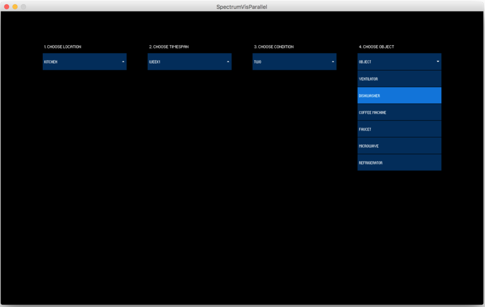
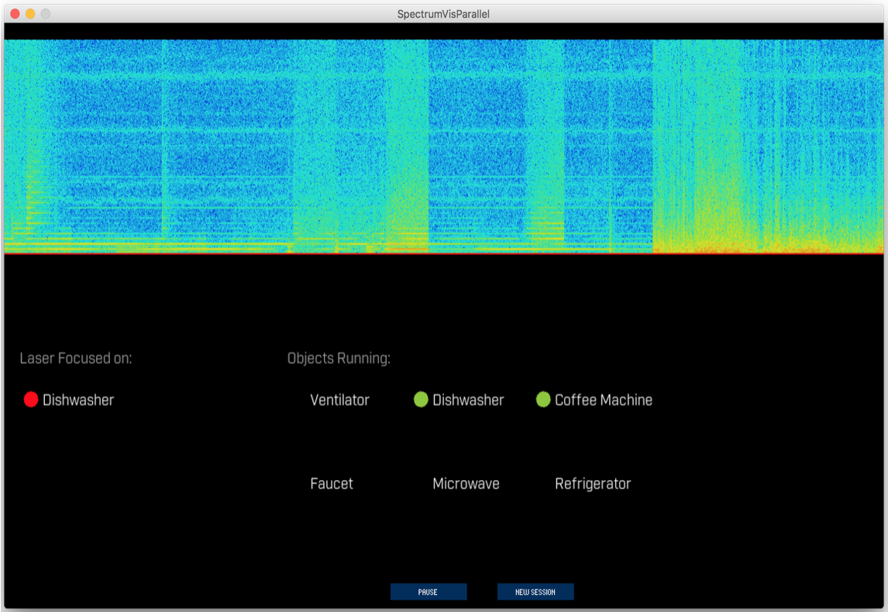
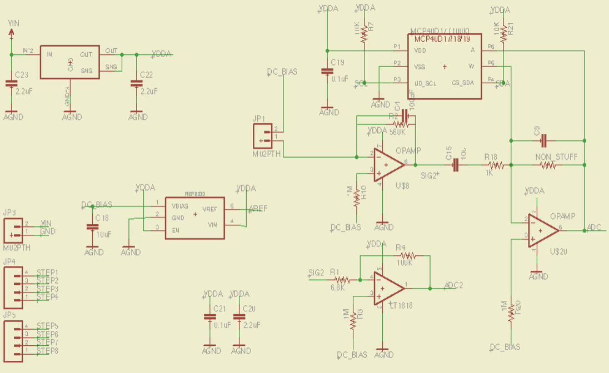
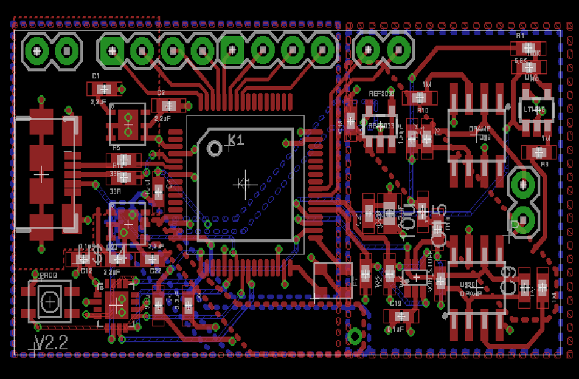
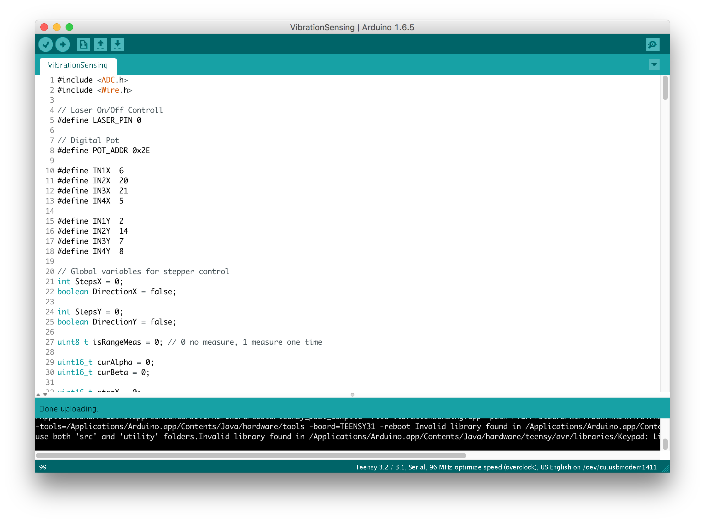
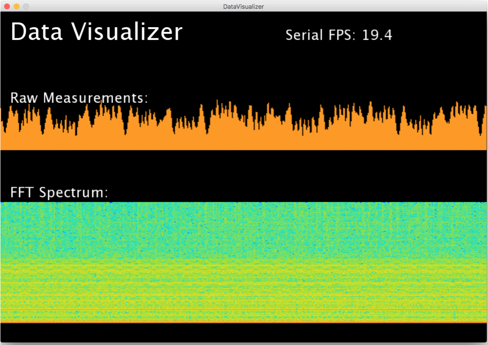
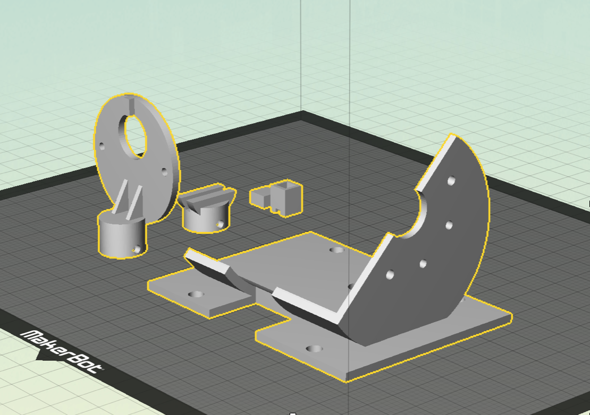

# Vibrosight
This repository contains source files for the project Vibrosight. The research publication and more details of this project can be found here: http://yang-zhang.me/research/Vibrosight/Vibrosight.html

## Usage

We uploaded all data collected in the evaluation session and wrote a visualizer to render the data offline. To run the visualizer, please download the repository and execute the pre-compiled visualizer code (i.e., ./data and visualizer/visualizer.jar). 

## Other resources
The hardware folder contains the Eagle PCB design files, including the schematic and the PCB layout:

The firmware is based on [Teensy 3.2](https://www.pjrc.com/teensy/teensy31.html) and can be edited and compiled with the [Arduino](https://www.arduino.cc) IDE. 

A real-time visualzer that visualize data streamed from the sensor board:

The 3D prints folder contains the model design files for the mirror-control platform:

